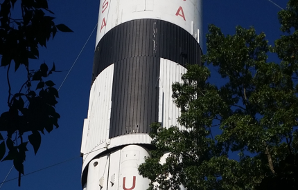
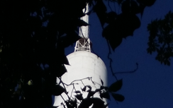
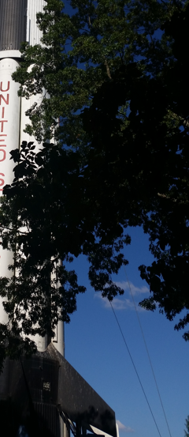

# A Rocket

## Authors
- Nick (@N-Tandiono) 😃

## Category
- Recon

## Description
This rocket is amazing! I wonder where it is, I want to go there and see it myself!

**Note:** Flag format is NEWBIE{State}, so Victoria will be NEWBIE{Victoria} and Western Australia will be NEWBIE{Western_Australia}

## Difficulty
- Medium

## Points
180

## Files
- rocket.jpg: image of a rocket somewhere

## Quick Non-Spoiler Notes by Author
- If I was to do this again having known the results, I would have asked the participant to be more specific in the type of rocket and location.
- I encountered that some teams did just write down the eventual right answer because of another rocket/launch location which isn't entirely right or intended.
- All rockets actually have a good amount of history, it is surprising how many actually exist and were semi-regularly constructed within the space race and persisting afterwards as well

## Solution

### Idea
- Really test people's ability to recon
- Researching different models
- Visual inspection on images to check for distinct characteristics

### Walkthrough
Searching in `rockets in US`, will show a wide variety of rockets. Go through them all (you may go through a few rabbit holes), but hopefully you got to Saturn IB which has distinct characteristics to the image we have.

Some characteristics I kept note of:

 

 

 

Searching `Saturn IB state`, going through each link will lead to finding out it was taken at the:

Saturn IB at the Alabama Welcome Center

Looking at some images it seems to confirm what we have here. The characteristics above, the trees which surround it, as well as the rocket being held down strongly!

 

### Flag
SHA256 encoded: `c7c16f22c2103043a1fc82974fe02918c0ef6ff2a21cf1685453ef32bd95d814`

Linux Command: `echo -n NEWBIE{WHATEVER_IS_HERE} | sha256sum`

Or use a SHA256 hash encryptor.

