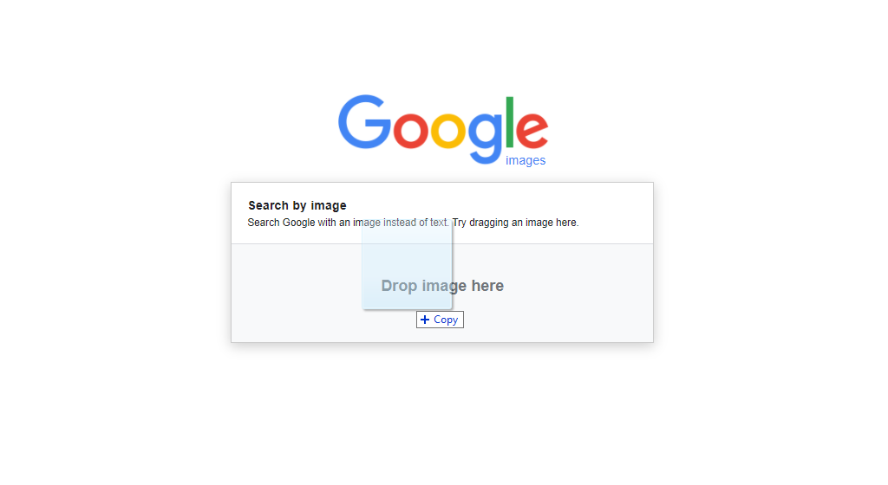

# Just Another Tall Building

## Authors
- Nick (@N-Tandiono) 😃

## Category
- Recon

## Description
No two tall buildings look the same... change my mind.

**Note:** Flag format is NEWBIE{City}, so Sydney will be NEWBIE{Sydney} and Rio de Janeiro will be NEWBIE{Rio_De_Janeiro}

## Difficulty
- Easy

## Points
50

## Files
- filename: description

Try include a link to the file where possible (such as within a repo).

## Solution

### Idea
- Reverse Image Searching
- Some people could guess the location straight away if they were familar

### Walkthrough

Easiest and fastest way.

Drag and Drop image into Google Images...

 

Done.

### Flag
SHA256 encoded: `7bd0d5972137e3a234282b3dd309877c905c40b68f0ce5eb17078c2fed3a2568`

Linux Command: `echo -n NEWBIE{WHATEVER_IS_HERE} | sha256sum`

Or use a SHA256 hash encryptor.
