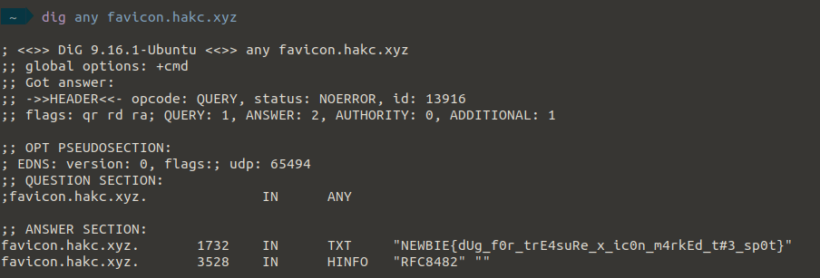

# Plumbing-Advice

## Authors

- Atharv (@Sequeli)

## Category

- Web Exploitation

## Description

I found this subdomain on SecSoc's website which takes a long time to load.
Looks like there might be some suspicious activity going on... or is there?

Could you see if there are any traces of possible attackers, and get _any_ information
you can about them?

[link](https://plumbing-advice.ctf.unswsecurity.com)

## Difficulty

- Medium

## Points

140

## Solution

<details>
<summary>Spoiler</summary>

### Idea

Look through the console and find the suspicious site.
Then dig the site to find the flag!

### Walkthrough

I'm going to be honest, this was mainly an exercise in learning some important tips for debugging/looking through websites.

Getting started, lets open up the website


_your mouse should also have changed into a thicc hand lol_

The first problem you would run into is that there is no way to access the devtools by right-clicking.  
But you always want to start with the dev tools, so if a website does not let you do it using the right click, the easiest way is to use the command `ctrl + shift + i` (or `cmd + shift + i` on a mac).


_ah, that looks like a mess_

I digress, but a really simple way to do this is with the code:

```html
<script>
  // ah well, have fun~~
  document.addEventListener("contextmenu", (event) => event.preventDefault());
</script>
```

which just does nothing when you try to open the context menu using right click.  
So next time when you open a website that does not let you access the console, say discord, try it out. :)

Another fun thing is that discord's desktop app is actually built on electron, which is essentially a web browser.  
Yes, that means you can open a console and execute arbitrary javascript in the discord desktop app (or any electron app for that matter). Yeet!

You should also know that you can view the page source directly in the browser by using the prefix: `view-source:` to any url. So for example, in this case: `view-source:https://plumbing-advice.ctf.unswsecurity.com/`


_that is a lot of libraries loaded, can't believe hackers are blamed for this_

Then all you need to do is find a suspicious site, some googling would show you that most of these are CSS/JS libraries, but if you scroll down, you should see the suspicious one immediately:


Plus, this site is no longer accessible, as seen from the console:


You should google the error you see there, but what it means, is that it could not convert `https://favicon.hakc.xyz` into an IP address, and hence cannot be found.

Now, the challenge description hints towards some kind of attackers to the site. If there is a page being loaded that can no longer be accessed, maybe the attackers were serving some kind of javascript from their domain, but have stopped it now?  
Nonetheless, it seems interesting.

The easiest way to start is to look into that error that we found in the console. `ERR_NAME_NOT_RESOLVED`.
The name resolution for a website takes place using a DNS (Domain Name Server) request. As said earlier, from a high level perspective, it converts website names or domains into IP addresses so that we can access it, but it also provides more information about the site itself.

With that in mind, we should now take a look at the DNS records that we can find. I would recommend reading a bit on DNS before doing the next part, but the easiest way to look up records is to use a tool called `dig` or `Domain Information Groper` to look up any records you can find.

You don't know which record to look for either, so use the `any` flag



You could use a webiste to query DNS records, but that is not recommended since you may not always be able to do it.

Feel free to reach out to me if you have any thoughts/issues/feedback

Quick shoutout to abiram for setting up the DNS for this challenge

#### Flag

```
NEWBIE{dUg_f0r_trE4suRe_x_ic0n_m4rkEd_t#3_sp0t}
```

</details>
