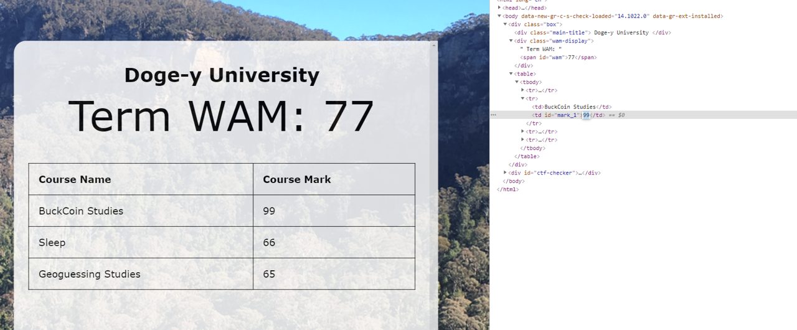

# Mark Inspection

## Authors
- Nick (@N-Tandiono) 😃

## Category
- Web

## Description
My interviewer is asking to inspect my marks... Hmmm, only if I could get some sort of temporary HD at this university... I did it once before... but yet again - temporary...

[Website link](https://inspecting-marks.ctf.unswsecurity.com)

## Difficulty
- Easy/Medium

## Points
50

## Quick Non-Spoiler Notes by Author
- There were actually two ways to solve this CTF challenge
- An easy way which fulfils the description of the challenge
- A harder way which is unintended but still important that the writeup will also cover

## Challenge Idea

### Story
Well all good challenges have a cool/funny story right?! This one is based on real-life, which I encountered whilst in highschool. We were getting our marks back for an exam, and someone on my table thought it would be 'funny' to fool our technology teacher that the marks were incorrect / broken. Besides, the system in place was that the teacher would manually input marks into their 'markbook' (idk what they call it) and then type them back into the computer. So in other words, there were many points of failure in which things could go wrong.

So what the guy sitting near me did was inspect element his marks to something over 100% (I think it was something like 110/100 or something like that). The teacher got very confused by this and checked over his main computer database, books and a lot of other things before finally getting his exam and realising that yes, he should have gotten something else. Something totally not say 110%. Now lets say the story ended there. The teacher is confused, doesn't know what happened and knows that the kid is getting a wrong mark... where did it go wrong in the system! They would be stuck here forever until maybe the next class when IT and all that are involved... (but for small tasks are people bothered to go through so much hassel - lets say not for marks though...)

The kid did end up saying how he did it (exactly this) and the teacher laughed it off (he was pretty chill and really interested how he did it). Now, neither SecSoc nor I endorse this behaviour as it is unethical to pretend to someone like a teacher. But if you really think about it, something like reloading the screen could easily be passed on as a glitch or bug - if you're naive to technology this could be you and not suspect a thing and move on. *You get nothing out of doing this, don't try fooling something like a teacher with it!*

### Real-World Applications
- Scams which try connect to the victim's computer try get access to a bank account and then inspect element to temporarily make the victim believe they have gotten more money than they were entitled to and then threatened to 'send some of it back'. When in fact, no transaction to their account was made from the start.
- A lesson that the user can do whatever they want if its on their own device.
- Unintended method shows that client side checks are not safe (someone is bound to break your security through obscurity, just a matter of time).


## Intended Solution

Given this writeup is for beginners, it is a bit more fleshed out than usual.
### Walkthrough

Image 1: Landing Page


Nothing interesting on visual inspection, other than a few things to laugh at

Image 2: CTRL+SHIFT+I or F12 or Right Click and go down to `Inspect` (For Windows). For Mac, COMMAND+SHIFT+I or Right Click and go down to `Inspect`.


(There are other methods, but these are the most common)

Well the challenge says to change the WAM to a HD so locate 70.

Image 3: Quick shortcut to go to 70 is to highlight, then right-click + go down to inspect and you will land there.


Hmm, 70 seems to be refreshing since I can only highlight it temporarily.

Image 4: Change the value to 90 (that's a HD), double clicking on 70


This doesn't work as it keeps refreshing so lets just play around and try changing the other numbers.

Image 5: Changing course mark of BuckCoin Studies changes WAM



Image 6: Doing it a little bit more gives a WAM equals/over 85 and the flag emerges!


Now have a look at unintended since it is as cool/much cooler!


## Unintended Solution

### Walkthrough

```html
<div id="ctf-checker">
    <div id="below-for-unintended-solution">
        <script>
            var _0x18f3=["\x77\x61\x6D","\x67\x65\x74\x45\x6C\x65\x6D\x65\x6E\x74\x42\x79\x49\x64","\x69\x6E\x6E\x65\x72\x54\x65\x78\x74","\x72\x6F\x75\x6E\x64","\x69\x6E\x6E\x65\x72\x48\x54\x4D\x4C","\x74\x68\x65\x6E","\x74\x65\x78\x74","\x2F\x66\x6C\x61\x67\x3F\x75\x3D","\x45\x52\x52\x4F\x52"];var wam=document[_0x18f3[1]](_0x18f3[0]);setInterval(wamChange,2000);function wamChange(){var _0xfc81x3=Math[_0x18f3[3]]((parseInt(mark_1[_0x18f3[2]])+ parseInt(mark_2[_0x18f3[2]])+ parseInt(mark_3[_0x18f3[2]]))/ 3);wam[_0x18f3[4]]= _0xfc81x3;if(_0xfc81x3>= 85&& _0xfc81x3<= 100){fetch(_0x18f3[7]+ encodeURIComponent(wam[_0x18f3[2]]))[_0x18f3[5]]((_0xfc81x5)=>{return _0xfc81x5[_0x18f3[6]]()})[_0x18f3[5]]((_0xfc81x4)=>{return wam[_0x18f3[2]]= _0xfc81x4});clearInterval(wamChange)}else {if(_0xfc81x3> 100|| _0xfc81x3< 0){wam[_0x18f3[2]]= _0x18f3[8]}else {}};if(parseInt(mark_1[_0x18f3[2]])> 100|| parseInt(mark_1[_0x18f3[2]])< 0){mark_1[_0x18f3[4]]= _0x18f3[8]};if(parseInt(mark_2[_0x18f3[2]])> 100|| parseInt(mark_2[_0x18f3[2]])< 0){mark_2[_0x18f3[4]]= _0x18f3[8]};if(parseInt(mark_3[_0x18f3[2]])> 100|| parseInt(mark_3[_0x18f3[2]])< 0){mark_3[_0x18f3[4]]= _0x18f3[8]}}
        </script>
    </div>
</div>
```

This is super sus... because it is!

Use any JavaScript Deobfuscator to make the code within the <script> </script> tags to be easier to read

Image 1: Using the first deobfuscator which popped up on search


Image 2: Most of the popular ones actually don't deobfuscate things like `\x77\x61\x6D`. If that's the case you can do this my using the console.


This looks most interesting right?

```javascript
if (_0xfc81x3 >= 85 && _0xfc81x3 <= 100) {
    fetch(_0x18f3[7] + encodeURIComponent(wam[_0x18f3[2]]))[_0x18f3[5]]((_0xfc81x5) => {
        return _0xfc81x5[_0x18f3[6]]()
    })[_0x18f3[5]]((_0xfc81x4) => {
        return wam[_0x18f3[2]] = _0xfc81x4
    });
    clearInterval(wamChange)
}
```

You can sort of make up what it is trying to say with the wider if statement. You also have `"/flag?u="` which also looks like a URL!

Image 3: Match the array indexes to words.


So fetch (some sort of web request) accessing `/flag?u=` and appending wam.innerText (some HTML language here) and having a then response.

Hence, you can try `https://inspecting-marks.ctf.unswsecurity.com/flag?u=100` (where 100 can be anywhere between >= 85 && <= 100 being consistent with the task)

Image 4: You got the flag using an unintended method!


**Moral here:** Try understand what the website is trying to do and how it is trying to connect with it's backend to collect the flag.


Easter Eggs:
- Background image was taken from the Blue Mountains if you are interested in Recon

### Flag
SHA256 encoded: `9a83c24b149a7e0d3eed06b66a1041cc52bd9dc7602d85aee379ecff4c29db27`

Linux Command: `echo -n NEWBIE{WHATEVER_IS_HERE} | sha256sum`

Or use a SHA256 hash encryptor.