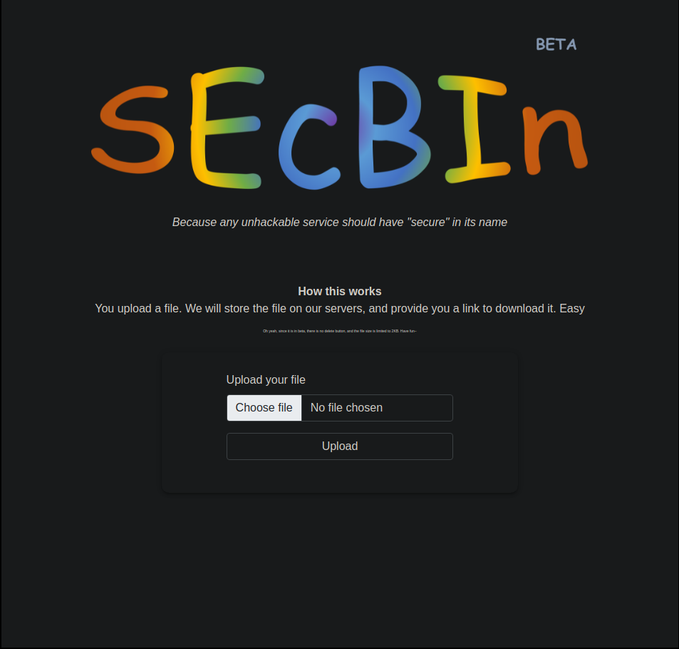
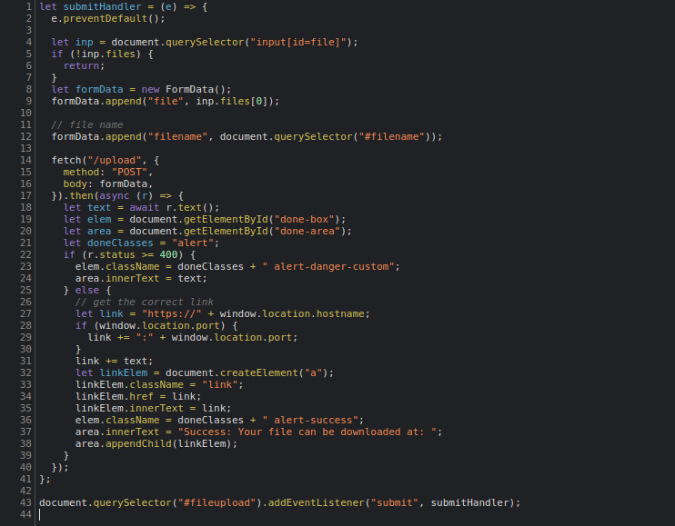
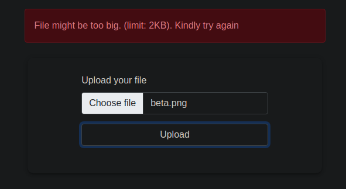
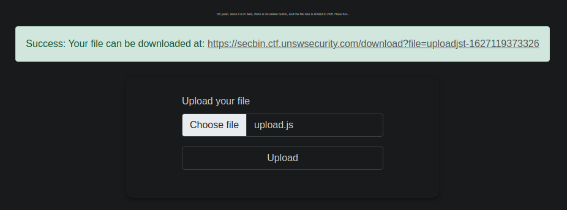
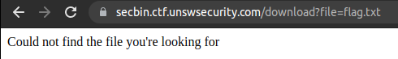
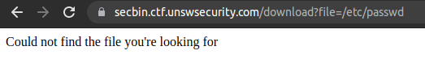
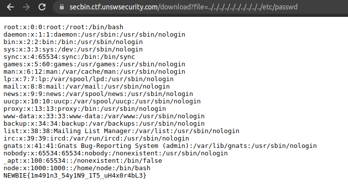

# SecBin

## Authors

- Atharv (@Sequeli)

## Category

- Web

## Description

Hmmmm, I tell ya, not everyone can just up and implement a secure file sharing service. But the secsoc admin says they have used their "experience" to make it unhackable.  
\*sigh\*  
Apparently they are running the app on a linux server, can you get their password file to prove them wrong?

https://secbin.ctf.unswsecurity.com/

## Difficulty

Medium

## Points

180

## Solution

<details>
<summary>Spoiler</summary>

### Idea

Use LFI (Local File Inclusion) to get the /etc/passwd file from the server

### Walkthrough

As said earlier, the main idea in this challenge is to find understand the local file inclusion vulnerability.  
In essence, the way this works is that you ask the server serving (usually static) files for a file that you should not be able to access. The server then happily gives you said file, breaking _authorization_.

In this case, going to the link drops you into a file sharing service:

  
_yes, I have dark mode. no, my eyes are not being scorched during the challenge_

You're free to play around the website, I recommend you look at the page as just a general web exploitation. In this case, you should find a file called [upload.js](./public/scripts/upload.js), which is responsible for making the api call to the backend...

  
_yeah, chrome added dark mode for the devtools, nice!_

Stripping off all the style changes made, we can see the code is basically:  
(I have left the failure case out here, since its not important)

```js
// making the fetch request...
fetch("/upload", {
  method: "POST",
  body: formData,
}).then(r => r.text())
  .then(res => {
    // success case
    let link = "https://" + window.location.hostname;
    link += res;
    console.log(link)
  }
});
```

The above code just makes a fetch request to the server when the form is submitted, and then when the server returns a result, it logs it to the console. Just from the variable name, you can guess that its probably some kind of a link that you get back from the server.  
**Note:** You didn't actually need to do this part, but it really helps if this was a harder challenge.

Next on the list is testing the site out! You upload a file, and if it is successful... (yes you need the file to be less than 2KB)

  
_there is a smaaaal tooltip right above, yes_


_and yes, I am using the source files to test_

...you should get a link to download it. On going to the link, you can see it gets downloaded as a text file.

Now that you know how the site works, you should think about how the site might be working. It takes a file from the user, and stores it somewhere. We can then request the file from the download link.  
Looks mostly normal. However, an interesting part is download link itself. Or to be specific, the name of the file.

- It seems as if the files are stored with a name very similar to the original filename,
- and then accessed for downloads by their filenames itself.
- Since there is no password functionality, and the files are meant to be shared, you only really need to know the name of the file to request it.

With that in mind, we can try accessing a file we never uploaded:



We couldn't access it. However, we don't know if the file exists on the server. What if we tried something that the challenge says might be on the server?  
In this case it is the `/etc/passwd` file, since the application runs on a linux server. But when we try that, we still get nothing



This is because its searching for the file in some kind of storage directory. So the actual path looks like:  
`/path/to/storage/directory/etc/passwd`  
which is again, a file that does not exist.

To get around this, we can use the `..` path, to go up a directory. Since we don't know how deep the path to storage directory is, we add a lot of `..`. This makes the path:  
`/path/to/storage/directory/../../../../../../../../../../etc/passwd`  
which linux will just interpret as `/etc/passwd`.

Now, trying this, we get:  


This is called a local file inclusion vulnerability, which I would recommend you read about :)

#### Flag

```
NEWBIE{1m491n3_54y1N9_1T5_uH4x0r4bL3}
```

</details>
