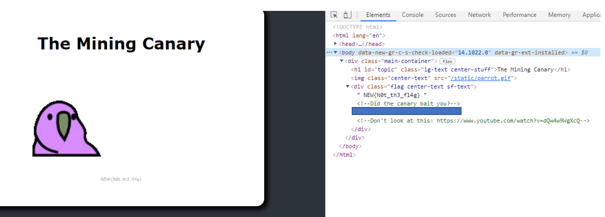

# The Mining Canary

## Authors
- Nick (@N-Tandiono) 😃

## Category
- Web

## Description
Ever heard of the mining canary? They were once used in mines to help detect colourless and toxic gas. Nowadays in security, they are sneaky baits for early detection, alerting defenders someone is snooping around places they shouldn't be in. You should try snooping around this site, maybe there is something interesting in the code.

[Website link](https://mining-canary.ctf.unswsecurity.com/)

## Difficulty
- Easy

## Points
80

## Quick Non-Spoiler Notes by Author
- Just generally really standard website challenge based on looking in the source code

## Challenge Idea

### Story
This one has a story! Amazing right?! Whilst the underlying source code challenge is pretty much very common, this theme is unique as it is also based on real-life! The challenge description tends towards this story of security canaries being used defensively as an early detection method. Warning of the presence of attackers where they can then be trapped and behaviour monitored. Whilst the idea of baits have always been used through the years within early battles, the canary within the cyber space has only recently been making a re-emergence to something that would 'take over the traditional honeypot'. Well that was how it was marketed anyway only from 2015 at a Black Hat 2015 Conference [Bring Back the HoneyPots](https://www.youtube.com/watch?v=W7U2u-qLAB8&ab_channel=BlackHat). And no, these conferences aren't super exclusive - really anyone can purchase tickets and attend where students get a special discount. SecSoc will be running one on 1st November if you are interested in attending a cool student led security conference!

Here, the idea was just that inputting NEW{} or a link would be some ways of early detection to let us know someone was on the challenge/snooping around the code. A pretty distant example, but one that is more playful and ethical. Now, I remember times in which people in highschool would walk away from their laptops and some 'clown' (just one of their mates who wasn't bothered to write his own notes) would just on his computer and try to airdrop notes to themselves or just take a look through and do a quick `rubber ducky` (no one knows how to do this in highschool luckily) -> but like USB and quickly copy files 🤷‍♂. Well, Canary Tokens can let you know if someone has opened something of yours!

There are ways you can have a peak at the source code here [Canary Tokens](https://github.com/thinkst/canarytokens) but when trying to access the site, use this instead [CanaryTokens Generate](https://canarytokens.org/generate) since the about tab uses `http` over `https` and it seriously bugs me...

*We do not endorse the sending of these links to be used offensively... More for personal security.*

But this method itself is not entirely perfect, as explained like honeypots 'catches those who don't know what they are doing and just casually looking around clicking files'.

### The Friendly Canary At Work

And many of these in team chats and global chat!

Thanks for being great sports everyone :)

(Me during the Skylight CTF)

 

**Mission success!**

### Real-World Applications
- Companies use honeypots to analyse their attackers and establish a threat model
- Just in general fun thing to catch attackers
- Personal security

## Solution

### Walkthrough

Image 1: F12 or Right click + Inspect Element -> look through elements, there is 1 part of the flag

Image 2: Look at sources in the same window (one of the top right tabs) and look at main.css, top of file there is part 2 of the flag

Image 3: Go to application in the same window (one of the top right tabs) and go to cookies. Look through and part 3 of the flag is there.

### Flag
SHA256 encoded: `b207f6328d63634d10331d74dc84538c25e5524837d4fa96323cdb10cc409af0`

Linux Command: `echo -n NEWBIE{WHATEVER_IS_HERE} | sha256sum`

Or use a SHA256 hash encryptor.